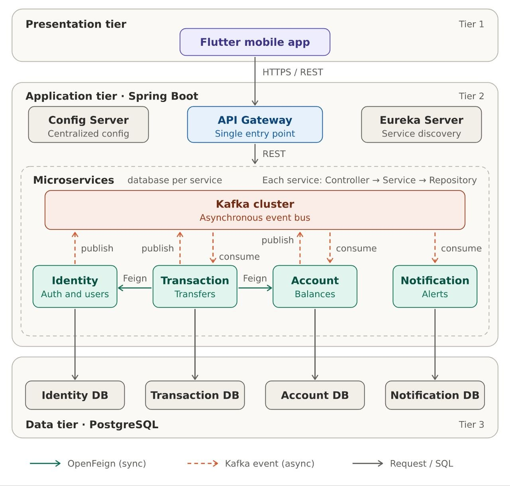

# NovaBank

A secure financial system built with a **Spring Boot microservices architecture** for managing users, accounts, money transfers, transactions, ledger records, and notifications.

> **Note:** NovaBank is an educational / portfolio project. It is not intended for real financial use.

## Features

* User registration and authentication
* JWT-based authentication
* Email OTP verification
* User profile management
* Account creation and balance management
* Send and receive money between accounts
* Transaction history
* In-app and email notifications
* PIN verification for transfers
* Asynchronous event-driven processing with Kafka
* Service discovery with Eureka
* Centralized configuration

## Architecture

NovaBank follows a **microservices architecture** where each service is responsible for a specific business domain.



### Services

| Service                  | Responsibility                                                     |
| ------------------------ | ------------------------------------------------------------------ |
| **config-service**       | Centralized configuration for all services                         |
| **discovery-service**    | Service registry using Eureka                                      |
| **gateway-service**      | API gateway, routing, and JWT validation                           |
| **identity-service**     | Users, authentication, profiles, roles, PINs, and OTP verification |
| **account-service**      | Accounts, balances, and account status                             |
| **transaction-service**  | Money transfers and transaction lifecycle                          |
| **notification-service** | In-app and email notifications                                     |

## Communication

NovaBank uses both synchronous and asynchronous communication.

### Synchronous

**OpenFeign** is used when a service requires an immediate response from another service.

```text
Transaction Service    
        |
        | OpenFeign  ---> Account Service
        v
Identity Service
```

### Asynchronous

**Apache Kafka** is used for event-driven communication between services.

```text
Transaction Service
        |
        | Event
        v
      Kafka
        |
        +----> Account Service
        |
        +----> Identity Service
        |
        +----> Notification Service
```

This reduces coupling between services and allows long-running operations to be processed asynchronously.

## Tech Stack

### Backend

* Java 21
* Spring Boot
* Spring Cloud
* Spring Security
* Spring Cloud Gateway
* Spring Cloud Config
* Netflix Eureka
* Spring Data JPA
* OpenFeign
* Apache Kafka
* JJWT
* Maven

### Database

* PostgreSQL

Each major service maintains its own database to preserve service independence.

### Mobile

* Flutter
* Dart
* Dio
* BLoC / Cubit

### Infrastructure

* Docker
* Docker Compose
* MailDev
* pgAdmin
* Apache Kafka
* PostgreSQL

## Authentication

NovaBank uses **JWT-based authentication**.

The API Gateway validates JWT tokens before forwarding protected requests to internal services.

```text
Flutter App
     |
     v
API Gateway
     |
     | Validate JWT
     v
Microservice
```

The system uses access and refresh tokens to maintain authenticated sessions.

## Registration Flow

Registration is designed as an asynchronous process.

```text
Flutter
   |
   v
API Gateway
   |
   v
Identity Service
   |
   | REGISTRATION_REQUESTED
   v
 Kafka
   |
   v
Identity Consumer
   |
   +--> Create PENDING user
   +--> Generate username
   +--> Generate OTP
   +--> Send verification email
            |
            v
       Verify OTP
            |
            v
      Activate User
            |
            +--> USER_CREATED
```

## Money Transfer

A transfer requires:

* Receiver wallet key
* Transfer amount
* Transaction PIN

The simplified flow is:

```text
Flutter
   |
   v
Transaction Service
   |
   +--> Validate PIN
   +--> Validate receiver
   +--> Validate accounts
   +--> Create PENDING transaction
   |
   v
 Kafka
   |
   v
Account Service
   |
   +--> Check balance
   +--> Debit sender
   +--> Credit receiver
   |
   v
Transaction Service to Update status
   |
   v
Notification Service
```

The transaction can initially remain in a **PENDING** state while the asynchronous processing is completed.

## Transactional Outbox

NovaBank uses the **Transactional Outbox Pattern** for reliable event publishing.

Business changes and their corresponding events are persisted as part of the same database transaction before the events are published to Kafka.

```text
Database Transaction
        |
        +--> Business Data
        |
        +--> Outbox Event
                  |
                  v
            Event Publisher
                  |
                  v
                Kafka
```

This helps prevent inconsistencies between database updates and event publishing.

## Project Structure

```text
NovaBank/
│
├── services/
│   ├── gateway-service/
│   ├── identity-service/
│   ├── account-service/
│   ├── transaction-service/
│   └── notification-service/
│
├── config-service/
├── discovery-service/
│
├── mobile/
│   └── Flutter application
│
├── docker-compose.yml
├── README.md
└── .gitignore
```

> The exact structure may vary depending on the current repository organization.

## Getting Started

### Prerequisites

Make sure you have:

* JDK 21+
* Maven
* Flutter SDK
* Docker
* Docker Compose
* Git
* PostgreSQL / Docker

### 1. Clone the repository

```bash
git clone https://github.com/NaelEbrahim/Financial-system-Backend.git
cd Financial-system-Backend
```

### 2. Configure the application

Real configuration files and secrets are not committed to the repository.

Copy the example configuration files:

```bash
cd config-service/src/main/resources/configurations

for f in *.example.yml; do
    cp "$f" "${f/.example/}"
done
```

Then update the generated configuration files with your local values, including:

* Database credentials
* JWT secret
* Kafka configuration
* Mail configuration
* Other required environment-specific settings

### 3. Start infrastructure

Start the required Docker services:

```bash
docker compose up -d
```

### 4. Start the backend services

Start the services in the following order:

1. `config-service`
2. `discovery-service`
3. `identity-service`
4. `account-service`
5. `transaction-service`
6. `notification-service`
7. `gateway-service`

Run each service with:

```bash
cd <service-name>
mvn spring-boot:run
```

### 5. Run the Flutter application

Navigate to the Flutter application:

```bash
cd mobile
```

Install dependencies:

```bash
flutter pub get
```

Run the application:

```bash
flutter run
```

## API Overview

All client requests are routed through the API Gateway.

| Area           | Example                       |
| -------------- | ----------------------------- |
| Authentication | `POST /auth/register`         |
| Authentication | `POST /auth/login`            |
| Account        | Account information endpoints |
| Transactions   | `POST /transaction/transfer`  |
| Transactions   | Transaction history endpoints |
| Notifications  | Notification endpoints        |

> API paths may change as the project evolves. Refer to the individual service controllers for the current endpoints.

## Configuration & Security

Sensitive configuration is never committed to GitHub.

The repository uses example configuration files such as:

```text
*.example.yml
```

Create your local configuration files from these templates and keep them out of version control.

Never commit:

* Passwords
* Database credentials
* JWT secrets
* API keys
* Private keys
* `.env` files containing secrets

## Development

Build the backend:

```bash
mvn clean install
```

Run tests:

```bash
mvn test
```

Check Docker services:

```bash
docker compose ps
```

Stop Docker services:

```bash
docker compose down
```

## Project Status

NovaBank is an ongoing **software engineering portfolio project** focused on applying real-world concepts including:

* Microservices architecture
* Event-driven architecture
* Distributed systems
* REST APIs
* JWT authentication
* Service discovery
* Centralized configuration
* Apache Kafka
* Transaction processing
* Transactional Outbox Pattern
* Flutter mobile development

## License

This project is licensed under the **MIT License**.

See the [LICENSE](LICENSE) file for details.
